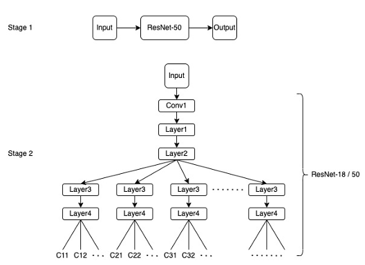

# Two Stage Classification
This repo is a two stage classification project.  
We select a subset of classes in ImageNet dataset and group them into clusters.  

Stage 1: Cluster classifier  
Stage 2: Class classifier  

## Model Pipeline

